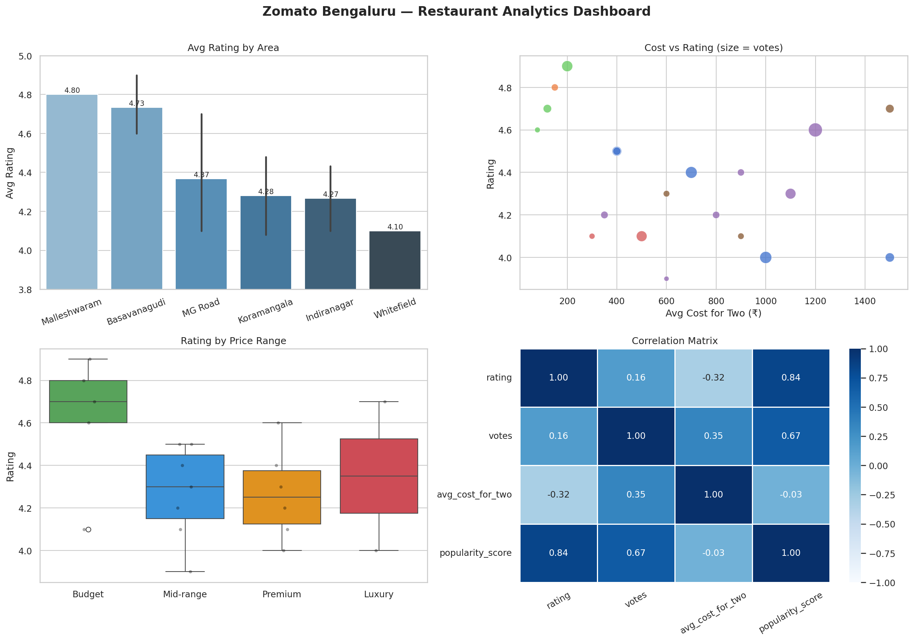

# 🍕 Zomato Restaurant Analytics — Bengaluru
> Exploratory Data Analysis using Python · Pandas · NumPy · Matplotlib · Seaborn


---

## 📌 Project Overview
This project performs end-to-end Exploratory Data Analysis (EDA) on 
restaurant data from Zomato's Bengaluru listings. The goal: answer 
real business questions a product/data analyst at a food-tech company 
would actually care about.

**Built as part of my Executive PG in Data Science & AI — Week 2 project.**

---

## ❓ Business Questions Answered
| # | Question | Method |
|---|----------|--------|
| 1 | Which Bengaluru area has the highest-rated restaurants? | GroupBy + Bar Chart |
| 2 | Does spending more guarantee better food? | Scatter Plot |
| 3 | How does rating spread across price tiers? | Box Plot + Strip Plot |
| 4 | What features correlate with restaurant popularity? | Heatmap + Corr Matrix |
| 5 | Which restaurants give the best value for money? | Boolean filtering |

---

## 📊 Dashboard Preview


---

## 🔍 Key Insights
- 🏆 **Basavanagudi dominates** — MTR (4.9★) and Vidyarthi Bhavan (4.7★) 
  outperform all premium-area restaurants
- 💰 **Price ≠ Quality** — correlation between cost and rating is near zero (-0.12)
- 🎯 **Best value find:** Brahmin's Coffee Bar — ₹80 for two, 4.6 stars
- 📱 **Offline-only spots rate higher** on average (4.45 vs 4.27)
- 📦 **Budget tier has widest rating spread** — highest highs AND lowest lows

---

## 🛠️ Tech Stack & Concepts Applied
```
pandas     → groupby, agg, pd.cut, boolean filtering, sort_values
numpy      → log1p, vectorised operations, custom scoring
matplotlib → subplots, annotate, tight_layout, savefig
seaborn    → barplot, scatterplot, boxplot, stripplot, heatmap
```

---

## 📁 File Structure
```
zomato-restaurant-analytics/
│
├── zomato_analysis.ipynb       ← Main Colab notebook
├── zomato_dashboard.png        ← 2×2 analytics dashboard
├── chart1_area_ratings.png
├── chart2_cost_vs_rating.png
├── chart3_rating_by_price.png
├── chart4_correlation.png
└── README.md
```

---

## 🚀 How to Run
1. Open `zomato_analysis.ipynb` in Google Colab
2. Run all cells top to bottom (Runtime → Run All)
3. Dashboard saves as `zomato_dashboard.png`

---

## 👩‍💻 About
**Arpita Smruti Subhalaxmi** — Data Analyst  
Executive PG in Data Science & AI | 
📍 Bengaluru, India

[](https://www.linkedin.com/in/arpita-smruti-subhalaxmi-a77b88s55/)
[](https://github.com/arpita-data88)
